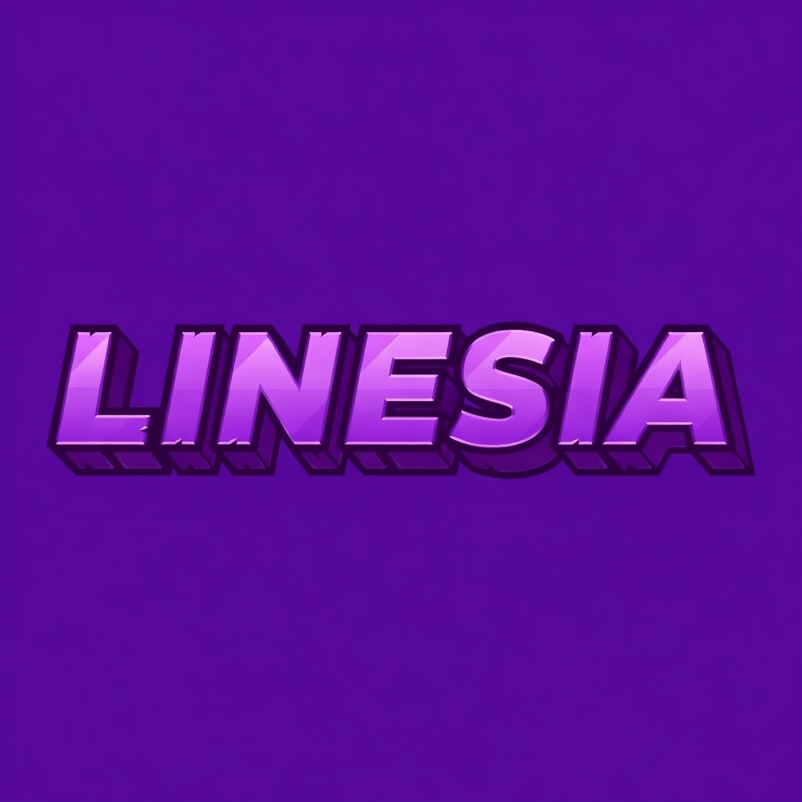

# Linesia - Minecraft Server Website

The official website for **Linesia**, a Minecraft PvP Faction server.

<p align="center">
  
</p>

## Design

### Color Palette

| Color | Hex | Usage |
|-------|-----|-------|
| Violet Dark | `#2B0036` | Very dark backgrounds, deep accents |
| Violet Deep | `#4A0A63` | Dark section backgrounds |
| Violet Strong | `#6A1B9A` | Hover states, secondary actions |
| Violet Vivid | `#8E2DE2` | **Primary accent**, CTAs, highlights |
| Violet Light | `#B84DFF` | Secondary accent, gradient endpoint |
| Violet Pastel | `#D47CFF` | Soft highlights, chart accents |
| Violet Glow | `#F2A6FF` | Very light fills, subtle backgrounds |
| Background | `#FFFFFF` | Page background |
| Background Soft | `#F1F4F8` | Alternating section background |
| Primary Soft | `#F3EAFF` | Icon backgrounds, subtle violet fills |
| Text | `#3F3F3F` | Primary text |
| Text Secondary | `#636363` | Secondary text |
| Text Muted | `#999999` | Muted labels |
| Border | `#E0E0E0` | Card borders, dividers |
| Discord | `#5865F2` | Discord accent |

### Gradients
- **Primary CTA / Gradient text**: `linear-gradient(135deg, #8E2DE2, #B84DFF)`
- **Progress bar / Card hover**: `linear-gradient(90deg, #8E2DE2, #B84DFF)`

### Assets
- **Logo**: `public/images/1024.jpg` (purple 3D "L")
- **Banner**: `public/images/1024_title.png` ("LINESIA" text)

## Tech Stack

- **Next.js 15** - React framework (App Router)
- **TypeScript** - Type safety
- **Tailwind CSS v4** - Utility-first styling
- **Framer Motion** - Animations
- **next-intl** - Internationalization (FR/EN)
- **Lucide React** - Icon library
- **Chart.js + react-chartjs-2** - Analytics charts
- **LibSQL** (@libsql/client) - Analytics database

## Getting Started

```bash
# Install dependencies
npm install

# Start development server
npm run dev

# Build for production
npm run build
```

Open [http://localhost:3000](http://localhost:3000) to view the site.

## Features

- Responsive design (mobile-first)
- Multi-language support (French & English)
- Animated hero with live player count
- Server IP copy functionality
- Store with Tebex integration
- FAQ accordion
- Floating white navbar with logo
- Scroll-triggered animations
- Admin panel with analytics dashboard
  - Players, economy, items, casino, retention, worlds
  - Chat logs (public, private, faction, staff)
  - Item tracing by unique ID (UID)
  - Staff activity monitoring

## Project Structure

```
src/
  app/[locale]/       # Pages (locale-based routing)
    admin/analytics/  # Admin panel pages
  components/         # Reusable UI components
  messages/           # Translation files (fr.json, en.json)
  i18n/               # Internationalization config
  lib/                # Utilities, DB helpers, configs
public/
  images/             # Logo (1024.jpg), Banner (1024_title.png)
```

## Deployment

Self-hosted on VPS. See `scripts/install-vps.sh` for the automated setup.

```bash
npm run build
npm start
```

## Links

- Server: `play.linesia.net`
- Discord: [discord.gg/linesia](https://discord.gg/linesia)
- Store: [linesia.tebex.io](https://linesia.tebex.io)
- Support: support@linesia.net
